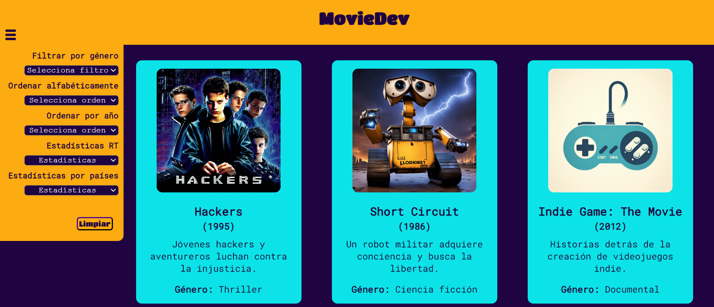
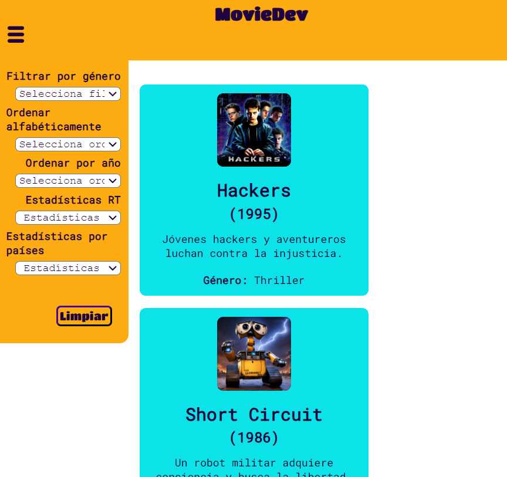

<h1>MovieDev</h1>

## Acerca de la Página Web

* [1. Resumen del proyecto](#1-resumen-del-proyecto)
* [2. Funcionalidades destacadas](#2-funcionalidades-destacadas)
* [3. Consideraciones técnicas](#3-consideraciones-técnicas)
* [4. Criterios de aceptación mínimos del proyecto](#4-criterios-de-aceptación-mínimos-del-proyecto)
* [5. Objetivos de aprendizaje](#5-objetivos-de-aprendizaje)

***

## 1. Resumen del Proyecto


#### Resultado para desktop



En este proyecto, hemos creado la plataforma web **MovieDev**, la cual funciona como una colección de tarjetas que abarcan 24 películas de los géneros: documental, thriller, ciencia ficción, drama y animación. Todos las películas vinculadas al fascinante mundo de la tecnología, pensando en nuestras usuarias ideales: "Desarrolladoras Web". La información recopilada se basa en un conjunto de datos generados con la colaboración de [ChatGPT](https://www.xataka.com/basics/chatgpt-que-como-usarlo-que-puedes-hacer-este-chat-inteligencia-artificial).

### Características principales

La página web **MovieDev** se centra en ofrecer tres funciones clave:

1. **Ordenamiento:** las películas pueden ser ordenadas de manera intuitiva.
2. **Filtrado:** la capacidad de filtrar la información.
3. **Estadísticas:** se realizan distintos cálculos con los datos de las 24 películas

---

## 2. Funcionalidades destacadas

### Ordenamiento 

- **Ordenamiento por año:** los usuarios pueden organizar la lista de películas según el año de lanzamiento, facilitando la exploración cronológica y permitiendo sumergirse en la evolución de las representaciones tecnológicas en el cine.

- **Ordenamiento por nombre:** la opción de ordenar alfabéticamente facilita la búsqueda de películas específicas por título, proporcionando una ruta rápida y eficiente a la información deseada.

### Filtrado

- La capacidad de filtrar las películas según su género: documental, thriller, ciencia ficción, drama y animación, permite a los usuarios obtener resultados específicos al explorar el contenido.

### Estadísticas

- **Estadísticas por puntaje:** selecciona y muestra en pantalla la data que cumple estrictamente con alguno de estos tres requisitos del puntaje en porcentaje, entre el 50% y 70%, 70% y 90%, y sobre el 90% de aceptación.

- **Estadísticas por país:** calcula la frecuencia de películas existentes por país, proporcionando una visión estadística de la distribución geográfica de las películas en el conjunto de datos de MovieDev.

### Diseño responsivo y estilo atractivo

- **Diseño adaptativo:** la página web ha sido diseñada pensando en la accesibilidad, siendo completamente responsive para adaptarse a dispositivos de diferentes tamaños, desde computadoras de escritorio hasta teléfonos móviles.

- **Estilo atractivo:** la interfaz se beneficia de un diseño estéticamente agradable, con colores y elementos visuales que mejoran la experiencia de navegación y destacan la temática tecnológica.
  
#### Resultado movil

(Pantalla responsive)

### Test unitarios:

**MovieDev** fue desarrollada en conjunto con un exhaustivo conjunto de pruebas unitarias en formato Jest, una herramienta ampliamente reconocida para la realización de pruebas en proyectos JavaScript. La ventaja clave de emplear pruebas unitarias radica en su capacidad para verificar la funcionalidad correcta de las diversas funciones y la eficaz modularización del código. Durante el proceso de prueba, nos enfocamos en cada componente individual, asegurándonos de que cumpliera con su propósito específico y de que la interacción entre ellos fuera coherente. Estas pruebas no solo ayudaron a identificar y corregir posibles errores, sino que también garantizaron la estabilidad y fiabilidad del sistema en su conjunto. Al incorporar el enfoque de prueba, pudimos abordar de manera proactiva cualquier inconveniente, lo que condujo a una aplicación MovieDev más confiable y funcional.

---

## 3. Consideraciones técnicas

La aplicación fue realizada en el marco del bootcamp para Desarrolladoras Web de <Laboratoria>, en el que a su vez se nos solicitaron las siguientes consideraciones técnicas:

* Las funcionalidades de ordenar deben operar sobre la data filtrada.
  Por ejemplo, si filtro las películas de comedia y luego las ordeno por
  nombre ascendentemente, la aplicación deberá mantener el filtro aplicado y
  ordenar las películas de comedia.

* La aplicación permite a la usuaria reiniciar la aplicación, limpiando
  filtros y ordenamiento, con un `<button>` con un atributo de datos
  `data-testid="button-clear"`.

* Las operaciones de filtrar, ordenar, limpiar, etc. no deben recargar
  la página, si no que deben agregar el contenido en una manera
  dinámica via javascript.

* La aplicación es  _responsive_, es decir, debe visualizarse sin problemas
  desde distintos tamaños de pantallas: móviles, tablets y desktops.

Diseño Mobile:

Tomamos en cuenta estas propuestas de <Laboratoria> para nuestro diseño:

* [Wireframe mobile 1](https://github.com/Laboratoria/curriculum/assets/123121338/54711bb7-cb05-448e-b677-3cbd9bf13c14)

Diseño Desktop:

* [Wireframe desktop 1](https://github-production-user-asset-6210df.s3.amazonaws.com/92090/261137084-1625aeb8-883c-4b79-86da-5fab34fa5b88.png)


### Estructura del Proyecto.

El _boilerplate_ contiene una estructura de archivos como punto de partida así
como toda la configuración de dependencias:

```text
.
├── README.md
├── package.json
├── src
|  ├── data 
|  |  └── dataset.js (La que hayas generado con la IA)
|  ├── dataFunctions.js
|  ├── view.js
|  ├── index.html
|  ├── main.js
|  └── style.css
└── test
   └── data.js
   └── dataFunctions.spec.js
   └── tests-read-only

```

## 4. Criterios de aceptación mínimos del proyecto

Al ser parte del programa de bootcamper Laboratoria para Desarrolladoras Web, el proyecto presenta criterios mínimos de aceptación para considerarse entregable, a continuación se describen:

### Criterios de código

Conjunto de pruebas que se superen exitosamente:
``` sh
npm run test:oas-html
npm run test:oas-css
npm run test:oas-web-api
npm run test:oas-js
npm run test:oas-prompting
npm run test:oas // Esto es para correr todos los tests de OAs
```

#### HTML

* **Uso de HTML semántico**

  - [x] Tiene un `<header>` con `<h1>`
  - [x] Tiene un `<footer>`
  - [x] Tiene un `<main>` con `<h2>`
  - [x] Todas las etiquetas de controles (inputs, selects, radio, etc) tienen `<label>`
  - [x] `<ul>` esta usado para dibujar la data
  - [x] Los hijos de `<li>` usan attributos de microdata `itemscope` e `itemprop`

#### CSS

* **Uso de selectores de CSS**

  - [x] Uso de selector class para los items <li>
  - [x] Uso de flexbox en sentido `row` y `column`
  - [x] Uso de flexbox para el elemento que contiene los items
  - [x] Uso de flexbox para el elemento que contiene los UI inputs

#### Web APIs

* **Uso de selectores del DOM**

  - [x] La aplicación usa [`querySelector`](https://developer.mozilla.org/en-US/docs/Web/API/Document/querySelector)
    para buscar los elementos del DOM
  
* **Manejo de eventos del DOM (listeners, propagación, delegación)**

  - [x] `addEventListener` con callback que tiene parámetro de `event`,
    lo que permite el uso del objeto [`event`](https://developer.mozilla.org/en-US/docs/Learn/JavaScript/Building_blocks/Events#event_objects)
    con `event.target` o `event.currentTarget`
  - [x] La aplicación registra [Event Listeners](https://developer.mozilla.org/en/docs/Web/API/EventTarget/addEventListener)
    para escuchar `click`, `change`, `keyup` dependiendo del evento que
    se quiere escuchar

* **Manipulación dinámica del DOM**

  - [x] La aplicación actualiza el atributo [`innerHTML`](https://developer.mozilla.org/es/docs/Web/API/Element/innerHTML).
  - [x] La aplicación usa `createElement` y `appendChild`, o template strings
    para crear elementos

#### JavaScript

* **Variables (declaración, asignación, ámbito)**

  - [x] La aplicación declara variables con [`let`](https://developer.mozilla.org/en-US/docs/Web/JavaScript/Reference/Statements/let)
    y [`const`](https://developer.mozilla.org/en-US/docs/Web/JavaScript/Reference/Statements/const)
    en manera adecuada

* **Uso de condicionales (if-else, switch, operador ternario, lógica booleana)**

  - [x] La aplicación usa el statement
    [`if..else`](https://developer.mozilla.org/en-US/docs/Web/JavaScript/Reference/Statements/if...else)
      para evaluar condiciones

* **Uso de bucles/ciclos (while, for, for..of)**

  - [x] La aplicación usa el statement [`for`](https://developer.mozilla.org/en-US/docs/Web/JavaScript/Reference/Statements/for)
    o método [`forEach`](https://developer.mozilla.org/en-US/docs/Web/JavaScript/Reference/Global_Objects/Array/forEach)
    para iterar

* **Funciones (params, args, return)**

  En el archivo `dataFunctions.js` define las siguientes funciones:
  - [x] una función `sortBy` que tiene 3 parámetros (`data`, `sortBy`, `sortOrder`)
    y devuelve el arreglo ordenado
  - [x] una función `filterBy` que tiene 3 parámetros (`data`, `filterBy`, `value`)
    y devuelve el arreglo filtrado
  - [x] una función `computeStats` que tiene al menos un parámetro (`data`)
    y devuelve un valor computado

  Más sobre estos puntos en [la sección dataFunctions.js](#src/dataFunctions.js)

* **Arrays (arreglos)**

  - [x] Uso de [Arreglos](https://curriculum.laboratoria.la/es/topics/javascript/04-arrays)
  - [x] Uso de [Array.prototype.sort() - MDN](https://developer.mozilla.org/es/docs/Web/JavaScript/Reference/Global_Objects/Array/sort)
    o [Array.prototype.toSorted - MDN](https://developer.mozilla.org/es/docs/Web/JavaScript/Reference/Global_Objects/Array/toSorted)
  - [x] Uso de [Array.prototype.forEach() - MDN](https://developer.mozilla.org/es/docs/Web/JavaScript/Reference/Global_Objects/Array/forEach)
  - [x] Uso de [Array.prototype.map() - MDN](https://developer.mozilla.org/es/docs/Web/JavaScript/Reference/Global_Objects/Array/map)
  - [x] Uso de [Array.prototype.filter() - MDN](https://developer.mozilla.org/es/docs/Web/JavaScript/Reference/Global_Objects/Array/filter)
  - [x] Uso de [Array.prototype.reduce() - MDN](https://developer.mozilla.org/es/docs/Web/JavaScript/Reference/Global_Objects/Array/Reduce)

* **Objetos**

  - [x] Uso de notación de punto para [acceder propiedades](https://developer.mozilla.org/en-US/docs/Web/JavaScript/Reference/Operators/Property_accessors)
  - [x] Uso de notación de brackets para [acceder propiedades](https://developer.mozilla.org/en-US/docs/Web/JavaScript/Reference/Operators/Property_accessors)

* **Módulos de ECMAScript (ES Modules)**

  - [x] La aplicación usa [`import`](https://developer.mozilla.org/en-US/docs/Web/JavaScript/Reference/Statements/import)
    y [`export`](https://developer.mozilla.org/en-US/docs/Web/JavaScript/Reference/Statements/export)
    para importar y exportar valores desde un modulo JavaScript.


#### Generación de datos 

Esta data tiene una estructura archivo javascript. Este archivo, exporta un arreglo con 24 objetos y la estructura de cada objeto
es la siguiente:

* `id`: Identificador único (no pueden haber dos elementos con el mismo `id`).
  Debe ser un string de no más de 32 characteres, en minúscula, compuesto solo
  por letras, números, underscore (`_`) o guión (`-`). Por ejemplo: `"ada-lovelace"`.
* `name`: El nombre del personaje, país, película, etc.
* `shortDescription`: Descripción corta del elemento. Esta descripción deberá
  tener como máximo 20 palabras.
* `description`: Descripción extendida del elemento. Esta descripción deberá
  tener entre 80 y 100 palabras. Al momento de mostrar este dato en pantalla
  puedes truncarlo para que no ocupe tanto espacio.
* `imageUrl`: URL de la imagen. Esta imagen será generada a través de alguna
  herramienta basada en inteligencia artifical. Una vez generada la imagen,
  y guardada en tu repo, deberás agregar la URL en este campo.
* `facts`: Un objeto con al menos **3** "hechos" o "info" sobre este elemento.

Un ejemplo de data de **MovieDev**:

```js
export default [
  {
    "id": "hackers",
    "name": "Hackers",
    "shortDescription": "Jóvenes hackers y aventureros luchan contra la injusticia.",
    "description": "Ambientada en el mundo del ciberespacio.....",
    "imageUrl": "https://raw.githubusercontent.com/MilenaPacheco/DEV013-dataverse/main/src/img/Hackers.png",
    "facts": {
      "yearMovie": 1995,
      "directorMovie": "Iain Softley",
      "productionCompany": "MGM",
      "genreMovie": "Thriller",
      "genreValue": "thriller"
    },
    "extraInfo": {
      "rottenTomatoesScore": "32%",
      "countryMovie": "Estados Unidos",
      "durationMovie": "107 minutos"
    }
  },
  },
  //... 23 objetos más
]
```

#### Prompt utilizado
A continuación se desglozará la estructura de la data utilizada en MovieDev:

##### Desglose de Propiedades:
```js
**id:** Identificador único de la película.
**name:** Título de la película ("Hackers").
**shortDescription:** Breve descripción de la trama.
**description:** Descripción detallada de la película.
**imageUrl:** URL de la imagen de la película.
**facts:** Objeto que contiene información factual sobre la película:
  **yearMovie:** Año de lanzamiento.
  **directorMovie:** Director de la película.
  **productionCompany:** Compañía productora.
  **genreMovie:** Género de la película.
  **genreValue:** Valor adicional asociado al género (en este caso, "thriller").
**extraInfo:** Información adicional sobre la película:
  **rottenTomatoesScore:** Puntuación en Rotten Tomatoes.
  **countryMovie:** País de origen de la película.
  **durationMovie:** Duración de la película.
```
Este objeto proporciona una representación completa y estructurada de la información relacionada con la película.

#### Capturas del prompting

La data utilizada en MovieDev se genero con ayuda de inteligencia artificial como se presenta a continuación:


Además, usamos imágenes generadas a través de inteligencia artificial. Ejemplo de promp y resultado:


#### Diseño de la Interfaz de Usuaria

Después de seleccionar la temática que queríamos trabajar: Web sobre películas de tecnología y desarrollo web, decidimos definir a nuestra usuaria ideal respondiendo las siguientes preguntas: 

##### ¿Quiénes son las principales usuarias del producto?

Mujeres, futuras programadoras Web. Con interés en inmersión en el mundo del desarrollo Web.

##### ¿Cuáles son los objetivos de estas usuarias en relación con el producto?
Saber más sobre tecnología, sus usos, alcances, historia, utopías y distopías. Contextualizarse más. Información para conversaciones interesantes con personas del rubro.

##### ¿Cuáles son los datos más relevantes que quieren ver en la interfaz y por qué?
Datos básicos y estadísticos interesantes. Resúmenes, imágenes asociadas a los films.

##### ¿Cuándo utilizan o utilizarían el producto?
En tiempo de ocio. 

Toda nuestra investigación derivó en todas las historias de usuaria de nuestro proyecto, que se muestran a continuación: 


##### Prototipos de alta, mediana y baja fidelidad

A continuación se muestran capturas de nuestros prototipos de baja, mediana y alta fidelidad. Para los cuales pedimos feedback a nuestras compañeras y coaches.

### Baja fidelidad


### Mediana fidelidad


Enlace: https://www.figma.com/proto/XNxIMUAnDnIHL85t7uu5W4/MovieDev-MEDIANA-F.?type=design&node-id=0-1&t=yTF97nxfWS6n1wPi-0&scaling=min-zoom&page-id=0%3A1&starting-point-node-id=17%3A175


### Alta fidelidad


Enlace: https://www.figma.com/file/6BDUns99NmJqwwlsWQ3NEA/Untitled?type=design&mode=design&t=Y5brons7GHSLIU9y-0


#### Testeos de usabilidad
Arrojaron lo siguiente:
- Problemas de usabilidad en la posición del menú de filtrado, ordenado y botones asociados, así como en la adecuación de sus tamaños. Este desafío surgió debido a que la disposición y el tamaño de estos son factores cruciales para garantizar una experiencia de usuario intuitiva y eficiente. Enfrentamos este desafío con un enfoque cuidadoso en el diseño de la interfaz.
- Teníamos muchos colores en el diseño de la interfaz. También resultaban muy brillantes.
- No funcionaba en cualquier tamaño de dispositivo.
- Se cargaban las tarjetas sin las imágenes.
- Fuentes muy grandes o ilegibles por falta de correcto contraste.
- Toda la página no tenía el mismo nivel de diseño, habían partes más crudas que otras.

Todos estos temas fueron considerados y abordados en nuestro entregable.


## 5. Objetivos de aprendizaje

Como equipo reflexionamos y marcamos los objetivos que hemos llegado a entender y aplicar en el proyecto. Estos objetivos fueron determinantes en nuestra estrategia de trabajo.

### HTML

- [x] **Uso de HTML semántico**

  <details><summary>Links</summary><p>

  * [HTML semántico](https://curriculum.laboratoria.la/es/topics/html/html5/semantic-html)
  * [Semantics - MDN Web Docs Glossary](https://developer.mozilla.org/en-US/docs/Glossary/Semantics#Semantics_in_HTML)
</p></details>

### CSS

- [x] **Uso de selectores de CSS**

  <details><summary>Links</summary><p>

  * [Intro a CSS](https://curriculum.laboratoria.la/es/topics/css/css/intro-css)
  * [CSS Selectors - MDN](https://developer.mozilla.org/es/docs/Web/CSS/CSS_Selectors)
</p></details>

- [x] **Modelo de caja (box model): borde, margen, padding**

  <details><summary>Links</summary><p>

  * [Box Model & Display](https://curriculum.laboratoria.la/es/topics/css/css/boxmodel-and-display)
  * [The box model - MDN](https://developer.mozilla.org/en-US/docs/Learn/CSS/Building_blocks/The_box_model)
  * [Introduction to the CSS box model - MDN](https://developer.mozilla.org/en-US/docs/Web/CSS/CSS_Box_Model/Introduction_to_the_CSS_box_model)
  * [CSS display - MDN](https://developer.mozilla.org/pt-BR/docs/Web/CSS/display)
  * [display - CSS Tricks](https://css-tricks.com/almanac/properties/d/display/)
</p></details>

- [x] **Uso de flexbox en CSS**

  <details><summary>Links</summary><p>

  * [A Complete Guide to Flexbox - CSS Tricks](https://css-tricks.com/snippets/css/a-guide-to-flexbox/)
  * [Flexbox Froggy](https://flexboxfroggy.com/#es)
  * [Flexbox - MDN](https://developer.mozilla.org/en-US/docs/Learn/CSS/CSS_layout/Flexbox)
</p></details>

### Web APIs

- [x] **Uso de selectores del DOM**

  <details><summary>Links</summary><p>

  * [Manipulación del DOM](https://curriculum.laboratoria.la/es/topics/browser/dom/1-dom-methods-selection)
  * [Introducción al DOM - MDN](https://developer.mozilla.org/es/docs/Web/API/Document_Object_Model/Introduction)
  * [Localizando elementos DOM usando selectores - MDN](https://developer.mozilla.org/es/docs/Web/API/Document_object_model/Locating_DOM_elements_using_selectors)
</p></details>

- [x] **Manejo de eventos del DOM (listeners, propagación, delegación)**

  <details><summary>Links</summary><p>

  * [Introducción a eventos - MDN](https://developer.mozilla.org/es/docs/Learn/JavaScript/Building_blocks/Events)
  * [EventTarget.addEventListener() - MDN](https://developer.mozilla.org/es/docs/Web/API/EventTarget/addEventListener)
  * [EventTarget.removeEventListener() - MDN](https://developer.mozilla.org/es/docs/Web/API/EventTarget/removeEventListener)
  * [El objeto Event](https://developer.mozilla.org/es/docs/Web/API/Event)
</p></details>

- [x] **Manipulación dinámica del DOM**

  <details><summary>Links</summary><p>

  * [Introducción al DOM](https://developer.mozilla.org/es/docs/Web/API/Document_Object_Model/Introduction)
  * [Node.appendChild() - MDN](https://developer.mozilla.org/es/docs/Web/API/Node/appendChild)
  * [Document.createElement() - MDN](https://developer.mozilla.org/es/docs/Web/API/Document/createElement)
  * [Document.createTextNode()](https://developer.mozilla.org/es/docs/Web/API/Document/createTextNode)
  * [Element.innerHTML - MDN](https://developer.mozilla.org/es/docs/Web/API/Element/innerHTML)
  * [Node.textContent - MDN](https://developer.mozilla.org/es/docs/Web/API/Node/textContent)
</p></details>

### JavaScript

- [x] **Diferenciar entre tipos de datos primitivos y no primitivos**

- [x] **Arrays (arreglos)**

  <details><summary>Links</summary><p>

  * [Arreglos](https://curriculum.laboratoria.la/es/topics/javascript/arrays)
  * [Array - MDN](https://developer.mozilla.org/es/docs/Web/JavaScript/Reference/Global_Objects/Array/)
  * [Array.prototype.sort() - MDN](https://developer.mozilla.org/es/docs/Web/JavaScript/Reference/Global_Objects/Array/sort)
  * [Array.prototype.forEach() - MDN](https://developer.mozilla.org/es/docs/Web/JavaScript/Reference/Global_Objects/Array/forEach)
  * [Array.prototype.map() - MDN](https://developer.mozilla.org/es/docs/Web/JavaScript/Reference/Global_Objects/Array/map)
  * [Array.prototype.filter() - MDN](https://developer.mozilla.org/es/docs/Web/JavaScript/Reference/Global_Objects/Array/filter)
  * [Array.prototype.reduce() - MDN](https://developer.mozilla.org/es/docs/Web/JavaScript/Reference/Global_Objects/Array/Reduce)
</p></details>

- [x] **Objetos (key, value)**

  <details><summary>Links</summary><p>

  * [Objetos en JavaScript](https://curriculum.laboratoria.la/es/topics/javascript/objects/objects)
</p></details>

- [x] **Variables (declaración, asignación, ámbito)**

  <details><summary>Links</summary><p>

  * [Valores, tipos de datos y operadores](https://curriculum.laboratoria.la/es/topics/javascript/basics/values-variables-and-types)
  * [Variables](https://curriculum.laboratoria.la/es/topics/javascript/basics/variables)
</p></details>

- [x] **Uso de condicionales (if-else, switch, operador ternario, lógica booleana)**

  <details><summary>Links</summary><p>

  * [Estructuras condicionales y repetitivas](https://curriculum.laboratoria.la/es/topics/javascript/flow-control/conditionals-and-loops)
  * [Tomando decisiones en tu código — condicionales - MDN](https://developer.mozilla.org/es/docs/Learn/JavaScript/Building_blocks/conditionals)
</p></details>

- [x] **Uso de bucles/ciclos (while, for, for..of)**

  <details><summary>Links</summary><p>

  * [Bucles (Loops)](https://curriculum.laboratoria.la/es/topics/javascript/flow-control/loops)
  * [Bucles e iteración - MDN](https://developer.mozilla.org/es/docs/Web/JavaScript/Guide/Loops_and_iteration)
</p></details>

- [x] **Funciones (params, args, return)**

  <details><summary>Links</summary><p>

  * [Funciones (control de flujo)](https://curriculum.laboratoria.la/es/topics/javascript/flow-control/functions)
  * [Funciones clásicas](https://curriculum.laboratoria.la/es/topics/javascript/functions/classic)
  * [Arrow Functions](https://curriculum.laboratoria.la/es/topics/javascript/functions/arrow)
  * [Funciones — bloques de código reutilizables - MDN](https://developer.mozilla.org/es/docs/Learn/JavaScript/Building_blocks/Functions)
</p></details>

- [x] **Pruebas unitarias (unit tests)**

  <details><summary>Links</summary><p>

  * [Empezando con Jest - Documentación oficial](https://jestjs.io/docs/es-ES/getting-started)
</p></details>

- [x] **Módulos de ECMAScript (ES Modules)**

  <details><summary>Links</summary><p>

  * [import - MDN](https://developer.mozilla.org/es/docs/Web/JavaScript/Reference/Statements/import)
  * [export - MDN](https://developer.mozilla.org/es/docs/Web/JavaScript/Reference/Statements/export)
</p></details>

- [x] **Uso de linter (ESLINT)**

- [x] **Uso de identificadores descriptivos (Nomenclatura y Semántica)**

- [x] **Diferenciar entre expresiones (expressions) y sentencias (statements)**

### Control de Versiones (Git y GitHub)

- [x] **Git: Instalación y configuración**

- [x] **Git: Control de versiones con git (init, clone, add, commit, status, push, pull, remote)**

- [x] **Git: Integración de cambios entre ramas (branch, checkout, fetch, merge, reset, rebase, tag)**

- [x] **GitHub: Creación de cuenta y repos, configuración de llaves SSH**

- [x] **GitHub: Despliegue con GitHub Pages**

  <details><summary>Links</summary><p>

  * [Sitio oficial de GitHub Pages](https://pages.github.com/)
</p></details>

- [x] **GitHub: Colaboración en Github (branches | forks | pull requests | code review | tags)**

### Centrado en el usuario

- [x] **Diseñar y desarrollar un producto o servicio poniendo a las usuarias en el centro**

### Diseño de producto

- [x] **Crear prototipos de alta fidelidad que incluyan interacciones**

- [x] **Seguir los principios básicos de diseño visual**

### Investigación

- [x] **Planear y ejecutar testeos de usabilidad de prototipos en distintos niveles de fidelidad**

  <details><summary>Links</summary><p>

  * [Intro a testeos usabilidad](https://coda.io/@bootcamp-laboratoria/contenido-ux/test-de-usabilidad-15)
  * [Pruebas con Usuarios 1 — ¿Qué, cuándo y para qué testeamos?](https://eugeniacasabona.medium.com/pruebas-con-usuarios-1-qu%C3%A9-cu%C3%A1ndo-y-para-qu%C3%A9-testeamos-7c3a89b4b5e7)
</p></details>

### AI Prompting

- [x] **Dando Instrucciones**

  <details><summary>Links</summary><p>

  * [Dando Instrucciones | Learn Prompting: Your Guide to Communicating with AI](https://learnprompting.org/es/docs/basics/instructions)
</p></details>

- [x] **Few shot prompting**

  <details><summary>Links</summary><p>

  * [Few shot prompting | Learn Prompting: Your Guide to Communicating with AI](https://learnprompting.org/es/docs/basics/few_shot)
</p></details>
