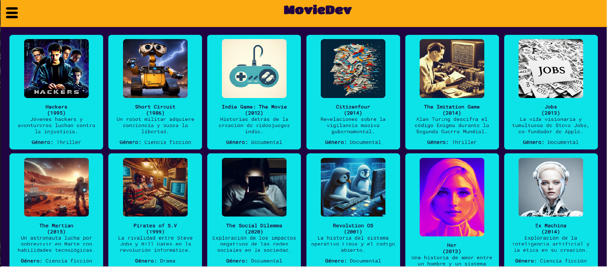
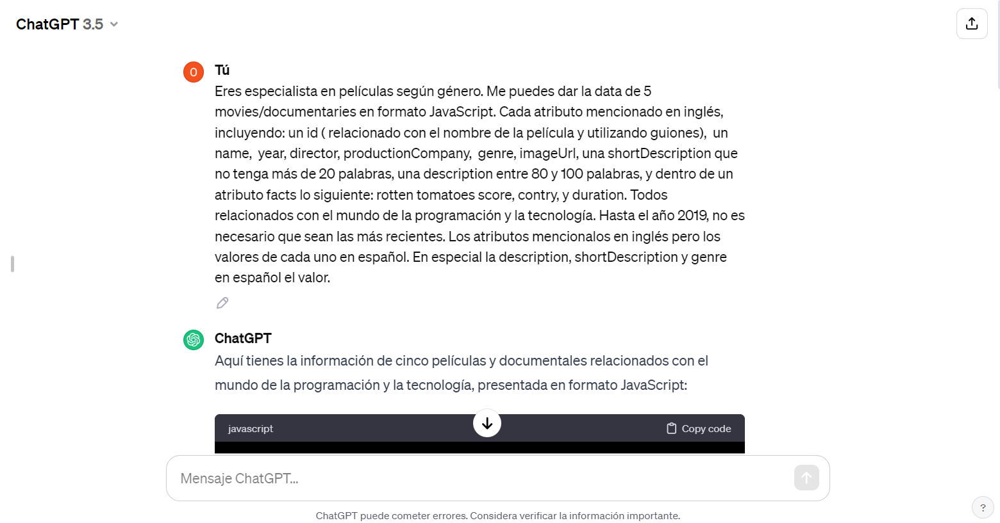
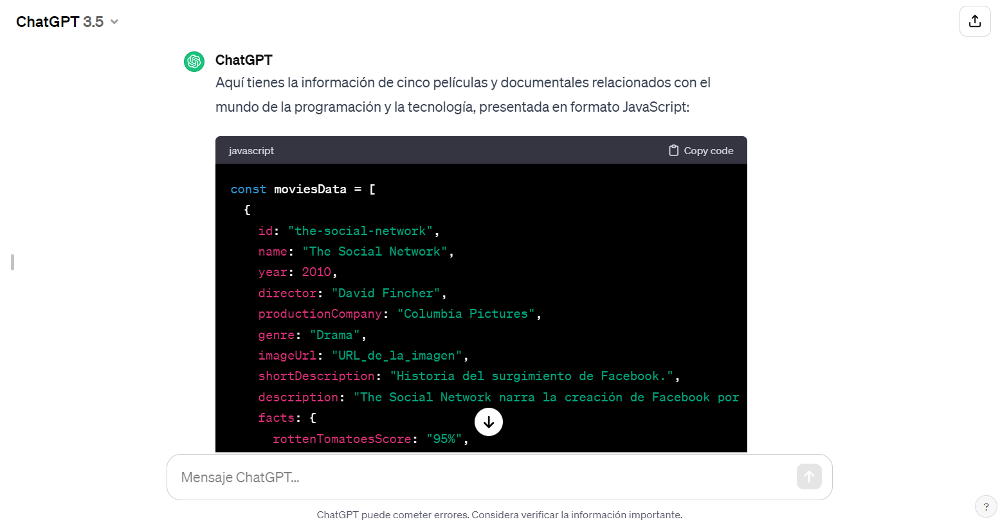
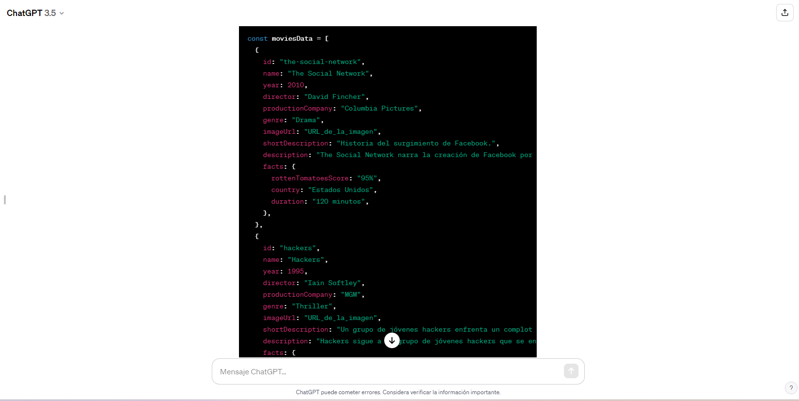
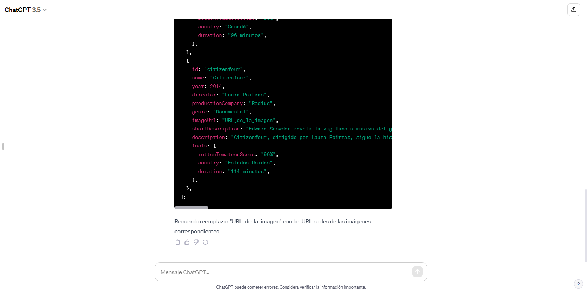
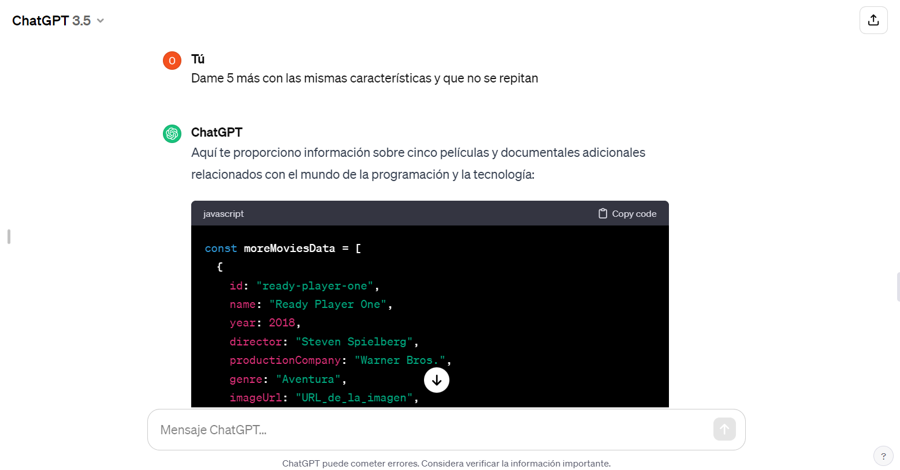

<h1>MovieDev</h1>

## Acerca de la Página Web

* [1. Resumen del proyecto](#2-resumen-del-proyecto)
* [3. Funcionalidades](#4-funcionalidades)
* [4. Consideraciones técnicas](#5-consideraciones-técnicas)
* [5. Criterios de aceptación mínimos del proyecto](#6-criterios-de-aceptación-mínimos-del-proyecto)
* [6. Objetivos de aprendizaje](#8-objetivos-de-aprendizaje)

***

## 1. Resumen del Proyecto



En este proyecto, se ha desarrollado la página web **MovieDev**, que sirve como un repositorio tipo tarjetas de películas, documentales y thrillers relacionados con el fascinante mundo de la tecnología. La información recopilada se basa en un conjunto de datos generado con la ayuda de [ChatGPT](https://www.xataka.com/basics/chatgpt-que-como-usarlo-que-puedes-hacer-este-chat-inteligencia-artificial).

### Características Principales

La página web MovieDev se centra en ofrecer dos funciones clave:

1. **Ordenamiento:**
   - Las películas pueden ser ordenadas de manera intuitiva, ya sea por el año de lanzamiento o por el nombre. Esto facilita a los usuarios explorar y acceder a la información de manera eficiente.

2. **Filtrado:**
   - La capacidad de filtrar la información permite a los usuarios obtener resultados específicos, brindando una experiencia personalizada al explorar el contenido. 

2. **Estadísticas:**
   - Se realizan distintos cálculos con los datos para mostrar la información aún más relevante a las usuarias

Estas funciones hacen que MovieDev sea una herramienta valiosa para aquellos interesados en descubrir y explorar películas que exploran el ámbito tecnológico de manera creativa e intrigante.

---

## 2. Funcionalidades Destacadas

### Exploración de Contenido Tecnológico Cinematográfico

**MovieDev** se presenta como una plataforma interactiva y visualmente atractiva diseñada para los amantes del cine y la tecnología. Aquí, los usuarios pueden explorar y descubrir una cuidadosa selección de películas, documentales y thrillers que exploran de manera creativa el mundo de la tecnología.

### Detalles Complejos y Filtrado Personalizado

- **Filtrado personalizado:** MovieDev va más allá de un simple catálogo y ofrece a los usuarios la capacidad de personalizar su experiencia. El sistema de filtrado permite buscar películas específicas según criterios como género.

### Ordenamiento 

- **Ordenamiento por año:** Los usuarios pueden organizar la lista de películas según el año de lanzamiento, facilitando la exploración cronológica y permitiendo sumergirse en la evolución de las representaciones tecnológicas en el cine.

- **Ordenamiento por nombre:** La opción de ordenar alfabéticamente facilita la búsqueda de películas específicas por título, proporcionando una ruta rápida y eficiente a la información deseada.

### Estadísticas

- **Estadísticas por puntaje:** Es una propiedad computada que selecciona y muestra en pantalla la data que cumple estrictamente con alguno de estos tres requisitos del puntaje en porcentaje, entre el 50% y 70%, 70% y 90%, y sobre el 90% de aceptación.

- **Estadísticas por país:** Calcula la frecuencia de películas existentes por país, proporcionando una visión estadística de la distribución geográfica de las películas en el conjunto de datos de MovieDev.

### Interactividad Dinámica

- **Función de búsqueda en tiempo real:** La función de búsqueda instantánea permite a los usuarios encontrar películas de manera rápida y eficiente, con resultados que se actualizan dinámicamente a medida que se escribe y se quiera filtrar por otros criterios.

### Diseño Responsivo y Estilo Atractivo

- **Diseño adaptativo:** La página web ha sido diseñada pensando en la accesibilidad, siendo completamente responsive para adaptarse a dispositivos de diferentes tamaños, desde computadoras de escritorio hasta teléfonos móviles.

- **Estilo atractivo:** La interfaz se beneficia de un diseño estéticamente agradable, con colores y elementos visuales que mejoran la experiencia de navegación y destacan la temática tecnológica.

 
---

Con estas funcionalidades, MovieDev se presenta como una herramienta completa para explorar, descubrir y sumergirse en la rica variedad de películas relacionadas con la tecnología, ofreciendo una experiencia única y personalizada para cada usuario.


## 3. Consideraciones Técnicas

* Las funcionalidades de ordenar deben operar sobre la data filtrada.
  Por ejemplo, si filtro las películas de comedia y luego las ordeno por
  nombre ascendentemente, la aplicación deberá mantener el filtro aplicado y
  ordenar las películas de comedia.

* La aplicación permite a la usuaria reiniciar la aplicación, limpiando
  filtros y ordenamiento, con un `<button>` con un atributo de datos
  `data-testid="button-clear"`.

* Las operaciones de filtrar, ordenar, limpiar, etc. no deben recargar
  la página, si no que deben agregar el contenido en una manera
  dinámica via javascript.

* La aplicación es  _responsive_, es decir, debe visualizarse sin problemas
  desde distintos tamaños de pantallas: móviles, tablets y desktops.

Diseño Mobile:

* [Wireframe mobile 1](https://github.com/Laboratoria/curriculum/assets/123121338/54711bb7-cb05-448e-b677-3cbd9bf13c14)

Diseño Desktop:

* [Wireframe desktop 1](https://github-production-user-asset-6210df.s3.amazonaws.com/92090/261137084-1625aeb8-883c-4b79-86da-5fab34fa5b88.png)


### Estructura del Proyecto.

El _boilerplate_ contiene una estructura de archivos como punto de partida así
como toda la configuración de dependencias:

```text
.
├── README.md
├── package.json
├── src
|  ├── data 
|  |  └── dataset.js (La que hayas generado con la IA)
|  ├── dataFunctions.js
|  ├── view.js
|  ├── index.html
|  ├── main.js
|  └── style.css
└── test
   └── data.js
   └── dataFunctions.spec.js
   └── tests-read-only

```

## 6. Criterios de aceptación mínimos del proyecto

### Criterios de código

Conjunto de Pruebas:
``` sh
npm run test:oas-html
npm run test:oas-css
npm run test:oas-web-api
npm run test:oas-js
npm run test:oas-prompting
npm run test:oas // Esto es para correr todos los tests de OAs
```

#### HTML

* **Uso de HTML semántico**

  - [ ] Tiene un `<header>` con `<h1>`
  - [ ] Tiene un `<footer>`
  - [ ] Tiene un `<main>` con `<h2>`
  - [ ] Todas las etiquetas de controles (inputs, selects, radio, etc) tienen `<label>`
  - [ ] `<ul>` esta usado para dibujar la data
  - [ ] Los hijos de `<li>` usan attributos de microdata `itemscope` e `itemprop`

#### CSS

* **Uso de selectores de CSS**

  - [ ] Uso de selector class para los items <li>
  - [ ] Uso de flexbox en sentido `row` y `column`
  - [ ] Uso de flexbox para el elemento que contiene los items
  - [ ] Uso de flexbox para el elemento que contiene los UI inputs

#### Web APIs

* **Uso de selectores del DOM**

  - [ ] La aplicación usa [`querySelector`](https://developer.mozilla.org/en-US/docs/Web/API/Document/querySelector)
    para buscar los elementos del DOM
  
* **Manejo de eventos del DOM (listeners, propagación, delegación)**

  - [ ] `addEventListener` con callback que tiene parámetro de `event`,
    lo que permite el uso del objeto [`event`](https://developer.mozilla.org/en-US/docs/Learn/JavaScript/Building_blocks/Events#event_objects)
    con `event.target` o `event.currentTarget`
  - [ ] La aplicación registra [Event Listeners](https://developer.mozilla.org/en/docs/Web/API/EventTarget/addEventListener)
    para escuchar `click`, `change`, `keyup` dependiendo del evento que
    se quiere escuchar

* **Manipulación dinámica del DOM**

  - [ ] La aplicación actualiza el atributo [`innerHTML`](https://developer.mozilla.org/es/docs/Web/API/Element/innerHTML).
  - [ ] La aplicación usa `createElement` y `appendChild`, o template strings
    para crear elementos

#### JavaScript

* **Variables (declaración, asignación, ámbito)**

  - [ ] La aplicación declara variables con [`let`](https://developer.mozilla.org/en-US/docs/Web/JavaScript/Reference/Statements/let)
    y [`const`](https://developer.mozilla.org/en-US/docs/Web/JavaScript/Reference/Statements/const)
    en manera adecuada

* **Uso de condicionales (if-else, switch, operador ternario, lógica booleana)**

  - [ ] La aplicación usa el statement
    [`if..else`](https://developer.mozilla.org/en-US/docs/Web/JavaScript/Reference/Statements/if...else)
      para evaluar condiciones

* **Uso de bucles/ciclos (while, for, for..of)**

  - [ ] La aplicación usa el statement [`for`](https://developer.mozilla.org/en-US/docs/Web/JavaScript/Reference/Statements/for)
    o método [`forEach`](https://developer.mozilla.org/en-US/docs/Web/JavaScript/Reference/Global_Objects/Array/forEach)
    para iterar

* **Funciones (params, args, return)**

  En el archivo `dataFunctions.js` define las siguientes funciones:
  - [ ] una función `sortBy` que tiene 3 parámetros (`data`, `sortBy`, `sortOrder`)
    y devuelve el arreglo ordenado
  - [ ] una función `filterBy` que tiene 3 parámetros (`data`, `filterBy`, `value`)
    y devuelve el arreglo filtrado
  - [ ] una función `computeStats` que tiene al menos un parámetro (`data`)
    y devuelve un valor computado

  Más sobre estos puntos en [la sección dataFunctions.js](#src/dataFunctions.js)

* **Arrays (arreglos)**

  - [ ] Uso de [Arreglos](https://curriculum.laboratoria.la/es/topics/javascript/04-arrays)
  - [ ] Uso de [Array.prototype.sort() - MDN](https://developer.mozilla.org/es/docs/Web/JavaScript/Reference/Global_Objects/Array/sort)
    o [Array.prototype.toSorted - MDN](https://developer.mozilla.org/es/docs/Web/JavaScript/Reference/Global_Objects/Array/toSorted)
  - [ ] Uso de [Array.prototype.forEach() - MDN](https://developer.mozilla.org/es/docs/Web/JavaScript/Reference/Global_Objects/Array/forEach)
  - [ ] Uso de [Array.prototype.map() - MDN](https://developer.mozilla.org/es/docs/Web/JavaScript/Reference/Global_Objects/Array/map)
  - [ ] Uso de [Array.prototype.filter() - MDN](https://developer.mozilla.org/es/docs/Web/JavaScript/Reference/Global_Objects/Array/filter)
  - [ ] Uso de [Array.prototype.reduce() - MDN](https://developer.mozilla.org/es/docs/Web/JavaScript/Reference/Global_Objects/Array/Reduce)

* **Objetos**

  - [ ] Uso de notación de punto para [acceder propiedades](https://developer.mozilla.org/en-US/docs/Web/JavaScript/Reference/Operators/Property_accessors)
  - [ ] Uso de notación de brackets para [acceder propiedades](https://developer.mozilla.org/en-US/docs/Web/JavaScript/Reference/Operators/Property_accessors)

* **Módulos de ECMAScript (ES Modules)**

  - [ ] La aplicación usa [`import`](https://developer.mozilla.org/en-US/docs/Web/JavaScript/Reference/Statements/import)
    y [`export`](https://developer.mozilla.org/en-US/docs/Web/JavaScript/Reference/Statements/export)
    para importar y exportar valores desde un modulo JavaScript.


#### Generación de datos 

Esta data tiene una estructura archivo javascript. Este archivo, exporta un arreglo con 24 objetos. Y la estructura de cada objeto
debe ser la siguiente:

* `id`: Identificador único (no pueden haber dos elementos con el mismo `id`).
  Debe ser un string de no más de 32 characteres, en minúscula, compuesto solo
  por letras, números, underscore (`_`) o guión (`-`). Por ejemplo: `"ada-lovelace"`.
* `name`: El nombre del personaje, país, película, etc.
* `shortDescription`: Descripción corta del elemento. Esta descripción deberá
  tener como máximo 20 palabras.
* `description`: Descripción extendida del elemento. Esta descripción deberá
  tener entre 80 y 100 palabras. Al momento de mostrar este dato en pantalla
  puedes truncarlo para que no ocupe tanto espacio.
* `imageUrl`: URL de la imagen. Esta imagen será generada a través de alguna
  herramienta basada en inteligencia artifical. Una vez generada la imagen,
  y guardada en tu repo, deberás agregar la URL en este campo.
* `facts`: Un objeto con al menos **3** "hechos" o "info" sobre este elemento, en
  formato `"nombre": "valor"`, por ejemplo:

  ```json
  "facts": {
    "yearOfBirth": 1843,
    "placeOfBirth": "London, England",
    "mainField": "Computer Science",
  }
  ```

  Los _nombres de las propiedades_, deben estar en formato _camelCase_.
  Por ejemplo **ninguno** de los siguientes nombres sería válido:

  ```json
  "facts": {
    "year_of_birth": 1843,
    "Place of Birth": "London, England",
    "MainField": "Computer Science",
  }
  ```

  Los _valores de las propiedades_, sólo pueden ser de tipo `number`, `boolean`
  o un `string` de no más de 64 caracteres (este **no** tiene restricciones sobre
  el tipo de caracteres que puede contener).

  Y por último ten en cuenta 2 cosas:
  - Todos los elementos del dataset deben compartir las mismas propiedades en
    `facts`, es decir, que si un elemento tiene una propiedad `yearOfBirth`,
    el resto de elementos del array también deben tener esa propiedad.
  - No es necesario que los nombres de las propiedades estén en inglés,
    `"lugarDeNacimiento"` es un nombre igual de válido.

* `extraInfo`: Y por último un campo libre opcional, similar a `facts`. Si lo
  necesitas, aquí puedes poner cualquier otro tipo de información en formato
  donde puedes poner otra info que necesites en formato `"nombre": "valor"`,
  pero sin restricciones sobre el tipo de dato del valor. Por ejemplo:

  ```json
  "extraInfo": {
    "imagePrompt": "Un texto bien, bien largo...",
    "writings": [
      "Vol. 1",
      "Vol. 2",
      "Vol. 3",
      "Vol. 4"
    ]
  }
  ```

Un ejemplo de data, según los requisitos anteriores podría ser:

```js
export default [
  {
    "id": "ada-lovelace",
    "name": "Ada Lovelace",
    "shortDescription": "Pionera de la informática, fue la primera programadora.",
    "description": "Una visionaria del siglo XIX ...",
    "imageUrl": "URL_DE_LA_IMAGEN_GENERADA",
    "facts": {
      "yearOfBirth": 1843,
      "placeOfBirth": "London, England",
      "mainField": "Computer Science",
    }
  },
  //... 23 objetos más
]
```

#### Prompt utilizado
A continuación se desglozará la estructura de la data utilizada en MovieDev:

##### Desglose de Propiedades:
**id:** Identificador único de la película.

**name:** Título de la película ("Hackers").

**shortDescription:** Breve descripción de la trama.

**description:** Descripción detallada de la película.

**imageUrl:** URL de la imagen de la película.

**facts:** Objeto que contiene información factual sobre la película:

**yearMovie:** Año de lanzamiento.
**directorMovie:** Director de la película.
**productionCompany:** Compañía productora.
**genreMovie:** Género de la película.
**genreValue:** Valor adicional asociado al género (en este caso, "thriller").
**extraInfo:** Información adicional sobre la película:

**rottenTomatoesScore:** Puntuación en Rotten Tomatoes.
**countryMovie:** País de origen de la película.
**durationMovie:** Duración de la película.
Este objeto proporciona una representación completa y estructurada de la información relacionada con la película.

#### Capturas del prompting








#### Diseño de la Interfaz de Usuaria

##### Prototipo de alta fidelidad

Usando los wireframes o bocetos (_sketches_) de tu solución de interfaz
como base, lo siguiente es diseñar tu Interfaz de Usuaria (UI por sus
siglas en inglés - _User Interface_). Para eso debes aprender a
utilizar alguna herramienta de diseño visual.
Nosotros te recomendamos [Figma](https://www.figma.com/) que es
una herramienta que funciona en el navegador y, además, puedes crear una cuenta
gratis. Sin embargo, eres libre de utilizar otros editores gráficos como
Illustrator, Photoshop, etc.

El diseño debe representar el _ideal_ de tu solución. Digamos que es lo que
desearías implementar si tuvieras tiempo ilimitado para trabajar. Además, tu
diseño debe seguir los fundamentos de _visual design_.

Recuerda pedir feedback de tu prototipo a tus compañeras y/o coaches.

#### Testeos de usabilidad

Durante el reto deberás hacer _tests_ de usabilidad con distintos usuarias,
y con base en los resultados, deberás iterar tus diseños. Cuéntanos
qué problemas de usabilidad detectaste a través de los _tests_ y cómo los
mejoraste en tu propuesta final.

## 8. Objetivos de aprendizaje


Reflexiona y luego marca los objetivos que has llegado a entender y aplicar en tu proyecto. Piensa en eso al decidir tu estrategia de trabajo.

### HTML

- [ ] **Uso de HTML semántico**

  <details><summary>Links</summary><p>

  * [HTML semántico](https://curriculum.laboratoria.la/es/topics/html/html5/semantic-html)
  * [Semantics - MDN Web Docs Glossary](https://developer.mozilla.org/en-US/docs/Glossary/Semantics#Semantics_in_HTML)
</p></details>

### CSS

- [ ] **Uso de selectores de CSS**

  <details><summary>Links</summary><p>

  * [Intro a CSS](https://curriculum.laboratoria.la/es/topics/css/css/intro-css)
  * [CSS Selectors - MDN](https://developer.mozilla.org/es/docs/Web/CSS/CSS_Selectors)
</p></details>

- [ ] **Modelo de caja (box model): borde, margen, padding**

  <details><summary>Links</summary><p>

  * [Box Model & Display](https://curriculum.laboratoria.la/es/topics/css/css/boxmodel-and-display)
  * [The box model - MDN](https://developer.mozilla.org/en-US/docs/Learn/CSS/Building_blocks/The_box_model)
  * [Introduction to the CSS box model - MDN](https://developer.mozilla.org/en-US/docs/Web/CSS/CSS_Box_Model/Introduction_to_the_CSS_box_model)
  * [CSS display - MDN](https://developer.mozilla.org/pt-BR/docs/Web/CSS/display)
  * [display - CSS Tricks](https://css-tricks.com/almanac/properties/d/display/)
</p></details>

- [ ] **Uso de flexbox en CSS**

  <details><summary>Links</summary><p>

  * [A Complete Guide to Flexbox - CSS Tricks](https://css-tricks.com/snippets/css/a-guide-to-flexbox/)
  * [Flexbox Froggy](https://flexboxfroggy.com/#es)
  * [Flexbox - MDN](https://developer.mozilla.org/en-US/docs/Learn/CSS/CSS_layout/Flexbox)
</p></details>

### Web APIs

- [ ] **Uso de selectores del DOM**

  <details><summary>Links</summary><p>

  * [Manipulación del DOM](https://curriculum.laboratoria.la/es/topics/browser/dom/1-dom-methods-selection)
  * [Introducción al DOM - MDN](https://developer.mozilla.org/es/docs/Web/API/Document_Object_Model/Introduction)
  * [Localizando elementos DOM usando selectores - MDN](https://developer.mozilla.org/es/docs/Web/API/Document_object_model/Locating_DOM_elements_using_selectors)
</p></details>

- [ ] **Manejo de eventos del DOM (listeners, propagación, delegación)**

  <details><summary>Links</summary><p>

  * [Introducción a eventos - MDN](https://developer.mozilla.org/es/docs/Learn/JavaScript/Building_blocks/Events)
  * [EventTarget.addEventListener() - MDN](https://developer.mozilla.org/es/docs/Web/API/EventTarget/addEventListener)
  * [EventTarget.removeEventListener() - MDN](https://developer.mozilla.org/es/docs/Web/API/EventTarget/removeEventListener)
  * [El objeto Event](https://developer.mozilla.org/es/docs/Web/API/Event)
</p></details>

- [ ] **Manipulación dinámica del DOM**

  <details><summary>Links</summary><p>

  * [Introducción al DOM](https://developer.mozilla.org/es/docs/Web/API/Document_Object_Model/Introduction)
  * [Node.appendChild() - MDN](https://developer.mozilla.org/es/docs/Web/API/Node/appendChild)
  * [Document.createElement() - MDN](https://developer.mozilla.org/es/docs/Web/API/Document/createElement)
  * [Document.createTextNode()](https://developer.mozilla.org/es/docs/Web/API/Document/createTextNode)
  * [Element.innerHTML - MDN](https://developer.mozilla.org/es/docs/Web/API/Element/innerHTML)
  * [Node.textContent - MDN](https://developer.mozilla.org/es/docs/Web/API/Node/textContent)
</p></details>

### JavaScript

- [ ] **Diferenciar entre tipos de datos primitivos y no primitivos**

- [ ] **Arrays (arreglos)**

  <details><summary>Links</summary><p>

  * [Arreglos](https://curriculum.laboratoria.la/es/topics/javascript/arrays)
  * [Array - MDN](https://developer.mozilla.org/es/docs/Web/JavaScript/Reference/Global_Objects/Array/)
  * [Array.prototype.sort() - MDN](https://developer.mozilla.org/es/docs/Web/JavaScript/Reference/Global_Objects/Array/sort)
  * [Array.prototype.forEach() - MDN](https://developer.mozilla.org/es/docs/Web/JavaScript/Reference/Global_Objects/Array/forEach)
  * [Array.prototype.map() - MDN](https://developer.mozilla.org/es/docs/Web/JavaScript/Reference/Global_Objects/Array/map)
  * [Array.prototype.filter() - MDN](https://developer.mozilla.org/es/docs/Web/JavaScript/Reference/Global_Objects/Array/filter)
  * [Array.prototype.reduce() - MDN](https://developer.mozilla.org/es/docs/Web/JavaScript/Reference/Global_Objects/Array/Reduce)
</p></details>

- [ ] **Objetos (key, value)**

  <details><summary>Links</summary><p>

  * [Objetos en JavaScript](https://curriculum.laboratoria.la/es/topics/javascript/objects/objects)
</p></details>

- [ ] **Variables (declaración, asignación, ámbito)**

  <details><summary>Links</summary><p>

  * [Valores, tipos de datos y operadores](https://curriculum.laboratoria.la/es/topics/javascript/basics/values-variables-and-types)
  * [Variables](https://curriculum.laboratoria.la/es/topics/javascript/basics/variables)
</p></details>

- [ ] **Uso de condicionales (if-else, switch, operador ternario, lógica booleana)**

  <details><summary>Links</summary><p>

  * [Estructuras condicionales y repetitivas](https://curriculum.laboratoria.la/es/topics/javascript/flow-control/conditionals-and-loops)
  * [Tomando decisiones en tu código — condicionales - MDN](https://developer.mozilla.org/es/docs/Learn/JavaScript/Building_blocks/conditionals)
</p></details>

- [ ] **Uso de bucles/ciclos (while, for, for..of)**

  <details><summary>Links</summary><p>

  * [Bucles (Loops)](https://curriculum.laboratoria.la/es/topics/javascript/flow-control/loops)
  * [Bucles e iteración - MDN](https://developer.mozilla.org/es/docs/Web/JavaScript/Guide/Loops_and_iteration)
</p></details>

- [ ] **Funciones (params, args, return)**

  <details><summary>Links</summary><p>

  * [Funciones (control de flujo)](https://curriculum.laboratoria.la/es/topics/javascript/flow-control/functions)
  * [Funciones clásicas](https://curriculum.laboratoria.la/es/topics/javascript/functions/classic)
  * [Arrow Functions](https://curriculum.laboratoria.la/es/topics/javascript/functions/arrow)
  * [Funciones — bloques de código reutilizables - MDN](https://developer.mozilla.org/es/docs/Learn/JavaScript/Building_blocks/Functions)
</p></details>

- [ ] **Pruebas unitarias (unit tests)**

  <details><summary>Links</summary><p>

  * [Empezando con Jest - Documentación oficial](https://jestjs.io/docs/es-ES/getting-started)
</p></details>

- [ ] **Módulos de ECMAScript (ES Modules)**

  <details><summary>Links</summary><p>

  * [import - MDN](https://developer.mozilla.org/es/docs/Web/JavaScript/Reference/Statements/import)
  * [export - MDN](https://developer.mozilla.org/es/docs/Web/JavaScript/Reference/Statements/export)
</p></details>

- [ ] **Uso de linter (ESLINT)**

- [ ] **Uso de identificadores descriptivos (Nomenclatura y Semántica)**

- [ ] **Diferenciar entre expresiones (expressions) y sentencias (statements)**

### Control de Versiones (Git y GitHub)

- [ ] **Git: Instalación y configuración**

- [ ] **Git: Control de versiones con git (init, clone, add, commit, status, push, pull, remote)**

- [ ] **Git: Integración de cambios entre ramas (branch, checkout, fetch, merge, reset, rebase, tag)**

- [ ] **GitHub: Creación de cuenta y repos, configuración de llaves SSH**

- [ ] **GitHub: Despliegue con GitHub Pages**

  <details><summary>Links</summary><p>

  * [Sitio oficial de GitHub Pages](https://pages.github.com/)
</p></details>

- [ ] **GitHub: Colaboración en Github (branches | forks | pull requests | code review | tags)**

### Centrado en el usuario

- [ ] **Diseñar y desarrollar un producto o servicio poniendo a las usuarias en el centro**

### Diseño de producto

- [ ] **Crear prototipos de alta fidelidad que incluyan interacciones**

- [ ] **Seguir los principios básicos de diseño visual**

### Investigación

- [ ] **Planear y ejecutar testeos de usabilidad de prototipos en distintos niveles de fidelidad**

  <details><summary>Links</summary><p>

  * [Intro a testeos usabilidad](https://coda.io/@bootcamp-laboratoria/contenido-ux/test-de-usabilidad-15)
  * [Pruebas con Usuarios 1 — ¿Qué, cuándo y para qué testeamos?](https://eugeniacasabona.medium.com/pruebas-con-usuarios-1-qu%C3%A9-cu%C3%A1ndo-y-para-qu%C3%A9-testeamos-7c3a89b4b5e7)
</p></details>

### AI Prompting

- [ ] **Dando Instrucciones**

  <details><summary>Links</summary><p>

  * [Dando Instrucciones | Learn Prompting: Your Guide to Communicating with AI](https://learnprompting.org/es/docs/basics/instructions)
</p></details>

- [ ] **Few shot prompting**

  <details><summary>Links</summary><p>

  * [Few shot prompting | Learn Prompting: Your Guide to Communicating with AI](https://learnprompting.org/es/docs/basics/few_shot)
</p></details>
